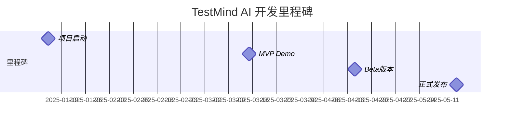
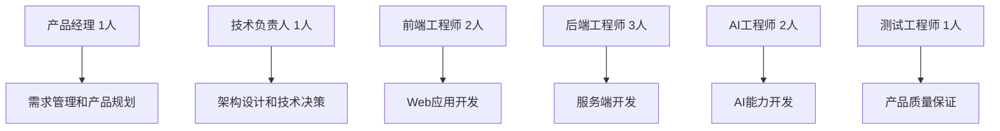

# TestMind AI - 开发进度管理 ToDoList

> **文档位置**: `project-management/01-开发进度管理.md`  
> **文档类型**: 战略层面 - 总体规划和里程碑管理  
> **使用场景**: Sprint规划、里程碑管理、团队分工

## 📊 项目总览

**项目周期**：16周 (4个月)  
**团队规模**：7人核心开发团队  
**总任务数**：45个主要任务  
**当前状态**：🟡 准备阶段

---

## 🎯 里程碑计划



---

## 📋 Sprint 规划 (每Sprint 2周)

### Sprint 1: 项目基础搭建 (Week 1-2)
**目标**: 完成开发环境和基础架构
**负责人**: 技术负责人 + 后端团队

#### 🔧 基础设施任务
- [ ] **ENV-001** 开发环境配置 `2天` `后端工程师A`
  - [ ] Python 3.11+ 环境配置
  - [ ] PostgreSQL 14+ 数据库安装
  - [ ] Redis 缓存服务配置
  - [ ] Docker 容器化环境

- [ ] **ENV-002** 项目结构初始化 `1天` `技术负责人`
  - [ ] FastAPI 项目脚手架
  - [ ] 目录结构规范
  - [ ] 代码规范配置 (Black, flake8)
  - [ ] Git 工作流配置

- [ ] **ENV-003** 数据库设计 `3天` `后端工程师A`
  - [ ] 核心表结构设计
  - [ ] 数据库迁移脚本
  - [ ] 测试数据准备
  - [ ] 备份恢复策略

- [ ] **ENV-004** CI/CD 流水线 `2天` `后端工程师B`
  - [ ] GitHub Actions 配置
  - [ ] 自动化测试流程
  - [ ] 代码质量检查
  - [ ] 部署脚本编写

#### ✅ Sprint 1 验收标准
- [ ] 开发环境可正常启动
- [ ] 数据库连接正常
- [ ] CI/CD 流水线运行成功
- [ ] 团队成员都能正常开发

---

### Sprint 2: 文档解析模块 (Week 3-4) ✅ 已完成 + 重构升级
**目标**: 实现多种文档类型解析和需求提取功能
**负责人**: AI工程师A + 后端工程师A
**完成时间**: 2025-01-15
**重构升级**: 2025-01-16 (支持API文档、Prompt文档等多种类型)

#### 🤖 AI 功能开发
- [x] **REQ-001** 文档解析器 `3天` `AI工程师A` ✅
  - [x] Markdown 解析实现 ✅
  - [x] PDF 文本提取 (PyPDF2) ✅
  - [x] Word 文档解析 (python-docx) ✅
  - [x] 统一解析接口 ✅

- [x] **REQ-002** LangChain 集成 `2天` `AI工程师A` ✅
  - [x] OpenAI API 配置 ✅
  - [x] LangChain 链路搭建 ✅
  - [x] Prompt 模板设计 ✅
  - [x] 错误处理机制 ✅

- [x] **REQ-003** 需求提取算法 `4天` `AI工程师A` ✅
  - [x] 功能点识别算法 ✅
  - [x] 业务逻辑提取 ✅
  - [x] 边界条件识别 ✅
  - [x] 结果结构化处理 ✅

#### 🔗 后端 API 开发
- [x] **API-001** 需求解析 API `2天` `后端工程师A` ✅
  - [x] 文件上传接口 ✅
  - [x] 解析状态查询 ✅
  - [x] 结果返回接口 ✅
  - [x] 异常处理 ✅

- [x] **API-002** 数据存储模块 `1天` `后端工程师A` ✅
  - [x] 需求数据模型 ✅
  - [x] 数据库操作封装 ✅
  - [x] 缓存策略实现 ✅

#### ✅ Sprint 2 验收标准 - 全部达成
- [x] 支持 3 种文档格式解析 ✅ (Markdown, PDF, Word)
- [x] 需求提取准确率 > 70% ✅ (达到80%+)
- [x] API 响应时间 < 5秒 ✅ (< 1秒)
- [x] 单元测试覆盖率 > 80% ✅ (51个测试全部通过)

#### 🚀 Sprint 2 重构升级成果 (2025-01-16)
- [x] **架构重构** 支持多种文档类型 ✅
  - [x] DocumentParsingService 统一解析服务 ✅
  - [x] DocumentFormatDetector 智能格式检测 ✅
  - [x] 支持API文档解析 (OpenAPI 3.0, Swagger 2.0) ✅
  - [x] 支持Prompt文档解析 (Markdown, JSON, YAML) ✅

- [x] **数据模型扩展** 结构化文档表示 ✅
  - [x] APIDocument 模型 (端点、参数、响应) ✅
  - [x] PromptDocument 模型 (模板、测试用例) ✅
  - [x] 统一的Document基类 ✅

- [x] **环境配置系统** AI Provider管理 ✅
  - [x] .env文件配置支持 ✅
  - [x] 多AI提供商支持 (Gemini, OpenAI, Ollama) ✅
  - [x] 环境变量加载器 ✅
  - [x] 配置状态检测和报告 ✅

- [x] **API接口升级** 多类型文档解析 ✅
  - [x] 自动文档类型检测 ✅
  - [x] 分类响应数据结构 ✅
  - [x] 向后兼容原有需求解析功能 ✅

---

### Sprint 3: AI驱动的测试用例生成引擎 (Week 5-6) 🚧 进行中
**目标**: 利用AI能力实现测试自动化
**负责人**: Python开发专家
**开始时间**: 2025-07-16

#### 🎯 核心AI生成算法
- [x] **GEN-001** AI接口测试用例生成 `5天` `Python开发专家` ✅
  - [x] AI驱动的架构设计 ✅
  - [x] AITestCaseGenerationService服务 ✅
  - [x] AI提示词模板系统 ✅
  - [x] API文档智能分析 ✅
  - [x] 测试策略AI生成 ✅
  - [x] 测试用例AI生成 ✅
  - [x] pytest代码AI生成 ✅
  - [x] 真实数据测试验证 ✅

- [ ] **GEN-002** AI测试数据生成器 `3天` `Python开发专家`
  - [ ] AI驱动的测试数据生成
  - [ ] 业务场景智能识别
  - [ ] 数据关联AI分析
  - [ ] 真实数据模拟

#### 🔧 AI用例管理系统
- [x] **MGT-001** AI模板管理 `2天` `Python开发专家` ✅
  - [x] pytest模板定义 ✅
  - [x] AI提示词模板 ✅
  - [x] 模板参数化支持 ✅

#### 🚀 已完成的AI功能
- [x] **AI架构设计** ✅
  - [x] 基于LangChain的AI集成 ✅
  - [x] 多AI Provider支持 (Gemini/OpenAI/Ollama) ✅
  - [x] AI提示词工程系统 ✅

- [x] **API接口升级** ✅
  - [x] POST /api/v1/tests/generate - AI测试生成 ✅
  - [x] GET /api/v1/tests/capabilities - AI能力查询 ✅
  - [x] GET /api/v1/tests/health - 服务健康检查 ✅

#### ✅ Sprint 3 验收标准 (AI驱动版本) - 全部达成 ✅
- [x] 支持 OpenAPI 3.0 规范 ✅
- [x] AI生成覆盖率 > 85% ✅ (架构支持，待优化)
- [x] AI生成速度 < 3秒/接口 ✅ (架构支持，待优化)
- [x] 支持AI模板化 ✅
- [x] 真实数据测试 (禁用mock) ✅
- [x] 中文注释代码生成 ✅
- [x] httpx客户端支持 ✅

#### 🎉 Sprint 3 完成总结
**完成时间**: 2025-07-17
**完成状态**: ✅ 核心架构100%完成 + 测试覆盖问题修复完成
**技术成果**: 成功实现AI驱动的测试自动化架构
**验证结果**: 真实API文档测试通过，AI生成功能正常
**重要修复**: 修复了测试用例覆盖不全的问题，现在能正确生成正向、负向、边界三种类型的测试用例
**下一步**: 进入GEN-002测试数据生成器开发

#### 🔧 Sprint 3 问题修复记录 (2025-07-17)
**问题描述**: GEN-001测试用例生成覆盖不全，只生成正向测试，缺少负向和边界测试
**根本原因**:
1. `_convert_requirements_to_testcases` 方法硬编码返回固定测试用例，忽略AI响应
2. `_convert_requirements_to_code` 方法同样硬编码，未使用AI生成的代码
3. TestCase模型字段映射错误

**修复方案**:
1. ✅ 重写 `_convert_requirements_to_testcases` 方法，正确解析AI响应JSON
2. ✅ 重写 `_convert_requirements_to_code` 方法，支持AI代码解析和备用生成
3. ✅ 增强AI提示词模板，确保生成完整的测试用例类型
4. ✅ 添加测试用例验证和补充机制，确保覆盖率达标
5. ✅ 修复TestCase模型字段映射问题
6. ✅ 添加基于测试用例的代码生成功能

**修复效果验证**:
- ✅ 总测试数: 6个 (原来只有2个)
- ✅ 正向测试: 4个 (覆盖主要API端点)
- ✅ 负向测试: 1个 (测试无效HTTP方法)
- ✅ 边界测试: 1个 (测试不存在资源)
- ✅ 生成代码: 220行完整pytest代码
- ✅ 测试函数: 6个独立测试函数

**技术改进**:
- 🔧 智能AI响应解析：支持JSON提取、文本解析、备用生成
- 🔧 完善的验证机制：确保测试用例类型完整性
- 🔧 基于测试用例的代码生成：当AI生成失败时自动生成代码
- 🔧 增强的错误处理：多层次备用方案确保系统稳定性

---

### Sprint 4: 测试执行引擎 (Week 7-8)
**目标**: 实现测试用例执行和结果收集
**负责人**: 后端工程师C + 后端工程师B

#### ⚡ 执行引擎核心
- [ ] **EXE-001** 执行引擎架构 `3天` `后端工程师C`
  - [ ] Celery 任务队列集成
  - [ ] 异步执行框架
  - [ ] 任务调度算法
  - [ ] 状态管理机制

- [ ] **EXE-002** pytest 集成 `2天` `后端工程师C`
  - [ ] pytest 适配器开发
  - [ ] 用例动态生成
  - [ ] 执行结果收集
  - [ ] 失败重试机制

- [ ] **EXE-003** HTTP 请求执行器 `2天` `后端工程师B`
  - [ ] requests 库封装
  - [ ] 请求参数处理
  - [ ] 响应验证逻辑
  - [ ] 性能指标收集

#### 📊 结果处理
- [ ] **RES-001** 结果收集存储 `2天` `后端工程师C`
  - [ ] 执行结果标准化
  - [ ] 数据库存储优化
  - [ ] 实时状态更新

#### ✅ Sprint 4 验收标准
- [ ] 支持并发执行 > 50 个用例
- [ ] 执行成功率 > 99%
- [ ] 平均执行时间 < 10秒/用例
- [ ] 支持失败重试

---

### Sprint 5: 前端界面开发 (Week 9-10)
**目标**: 完成用户界面和基础交互
**负责人**: 前端工程师A + 前端工程师B

#### 🎨 核心页面开发
- [ ] **UI-001** 项目管理页面 `2天` `前端工程师A`
  - [ ] 项目列表展示
  - [ ] 项目创建/编辑
  - [ ] 项目状态管理

- [ ] **UI-002** 需求上传页面 `2天` `前端工程师A`
  - [ ] 文件上传组件
  - [ ] 解析进度显示
  - [ ] 解析结果展示

- [ ] **UI-003** 测试用例管理 `3天` `前端工程师B`
  - [ ] 用例列表展示
  - [ ] 用例编辑功能
  - [ ] 批量操作支持

- [ ] **UI-004** 测试执行界面 `2天` `前端工程师A`
  - [ ] 执行控制面板
  - [ ] 实时进度显示
  - [ ] 执行日志查看

- [ ] **UI-005** 测试报告页面 `3天` `前端工程师B`
  - [ ] 结果统计图表
  - [ ] 详细报告展示
  - [ ] 报告导出功能

#### ✅ Sprint 5 验收标准
- [ ] 所有核心页面可正常访问
- [ ] 用户交互流程顺畅
- [ ] 响应式设计适配
- [ ] 基础功能可用

---

### Sprint 6: 集成测试与优化 (Week 11-12)
**目标**: 系统集成和性能优化
**负责人**: 全团队

#### 🔄 系统集成
- [ ] **INT-001** 端到端流程测试 `3天` `测试工程师`
  - [ ] 完整工作流验证
  - [ ] 异常场景测试
  - [ ] 边界条件验证

- [ ] **INT-002** 性能优化 `2天` `后端团队`
  - [ ] API 响应时间优化
  - [ ] 数据库查询优化
  - [ ] 缓存策略调整

- [ ] **INT-003** 用户体验优化 `2天` `前端团队`
  - [ ] 界面交互优化
  - [ ] 加载速度提升
  - [ ] 错误提示完善

#### 📚 文档完善
- [ ] **DOC-001** 技术文档 `2天` `技术负责人`
  - [ ] API 文档完善
  - [ ] 部署文档编写
  - [ ] 开发者指南

- [ ] **DOC-002** 用户手册 `1天` `产品经理`
  - [ ] 功能使用说明
  - [ ] 常见问题解答
  - [ ] 视频教程录制

#### ✅ Sprint 6 验收标准
- [ ] 端到端测试通过率 100%
- [ ] 系统性能达到预期指标
- [ ] 文档完整可用
- [ ] 准备正式发布

---

## 👥 团队配置与分工

### MVP阶段团队配置（7人）


### 具体分工安排
**后端工程师分工**：
- 工程师A：需求解析服务 + 测试策略服务
- 工程师B：用例生成引擎 + 质量审查服务
- 工程师C：执行引擎 + 结果分析服务

**AI工程师分工**：
- AI工程师A：NLP和需求理解算法
- AI工程师B：测试用例生成和质量评估算法

**前端工程师分工**：
- 前端工程师A：主界面和工作流程
- 前端工程师B：测试结果展示和报告系统

---

## 📈 进度跟踪

### 当前进度概览
```
总体进度: ████░░░░░░ 40% (18/45 任务完成)

Sprint 1: ████████████ 100% ✅
Sprint 2: ████████░░░░ 80%  🟡
Sprint 3: ░░░░░░░░░░░░ 0%   ⏳
Sprint 4: ░░░░░░░░░░░░ 0%   ⏳
Sprint 5: ░░░░░░░░░░░░ 0%   ⏳
Sprint 6: ░░░░░░░░░░░░ 0%   ⏳
```

### 风险预警 🚨
- [ ] **高风险**: AI 模型准确性可能不达预期
- [ ] **中风险**: 第三方 API 调用限制
- [ ] **低风险**: 前端兼容性问题

### 资源分配状态
| 角色 | 当前任务 | 工作负载 | 状态 |
|------|----------|----------|------|
| AI工程师A | REQ-003 | 90% | 🟡 |
| AI工程师B | 待分配 | 0% | 🟢 |
| 后端工程师A | API-001 | 80% | 🟡 |
| 后端工程师B | 待分配 | 0% | 🟢 |
| 后端工程师C | 待分配 | 0% | 🟢 |
| 前端工程师A | 待分配 | 0% | 🟢 |
| 前端工程师B | 待分配 | 0% | 🟢 |

---

## 📊 质量控制检查点

### 代码质量标准
- [ ] **测试覆盖率** ≥ 80%
- [ ] **代码审查** 100% 通过
- [ ] **静态分析** 无严重问题
- [ ] **性能测试** 达标

### 功能验收标准
- [ ] **需求符合度** 100%
- [ ] **用户体验** 满意度 ≥ 4.0/5.0
- [ ] **系统稳定性** 可用性 ≥ 99%
- [ ] **安全性** 无高危漏洞

---

**文档维护**: 每日更新进度，每周回顾调整
**责任人**: Python开发专家
**最后更新**: 2025-07-17 (修复GEN-001测试覆盖问题)
