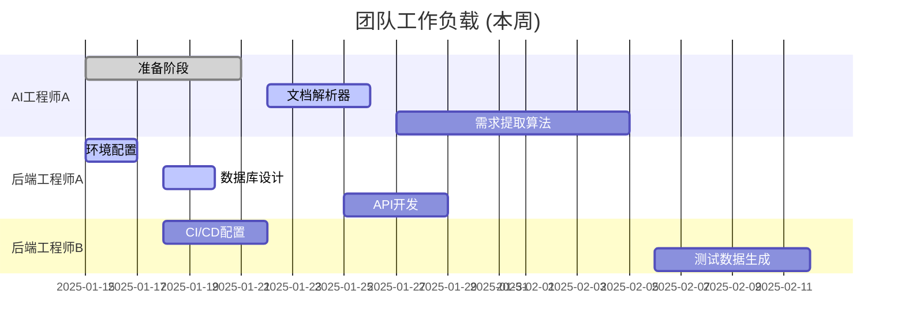

# TestMind AI - 任务看板

> **文档位置**: `project-management/03-任务看板.md`  
> **文档类型**: 操作层面 - 实时状态管理和每日协作  
> **使用场景**: 每日站会、任务状态更新、团队协作

## 🏃‍♂️ 当前Sprint: Sprint 2 - 需求解析模块 ✅ 已完成

**Sprint周期**: 2025-01-15 ~ 2025-01-29 (2周)
**Sprint目标**: 实现文档解析和需求提取功能 ✅

---

## 📋 任务状态看板

### 🔄 进行中 (Doing)
| 任务 | 负责人 | 预计完成 | 进度 | 优先级 |
|------|--------|----------|------|--------|
| 暂无 | - | - | - | - |

### ⏳ 待办 (To Do)
| 任务 | 负责人 | 计划开始 | 预估工时 | 优先级 |
|------|--------|----------|----------|--------|
| GEN-001 接口测试用例生成 | AI工程师B | 01-30 | 40h | P0 |
| GEN-002 测试数据生成器 | 后端工程师B | 02-01 | 24h | P0 |
| MGT-001 用例模板管理 | 后端工程师B | 02-03 | 16h | P0 |

### ✅ 已完成 (Done)
| 任务 | 负责人 | 完成时间 | 实际工时 |
|------|--------|----------|----------|
| ENV-001 开发环境配置 | 后端工程师A | 01-15 | 16h |
| ENV-002 项目结构初始化 | 技术负责人 | 01-15 | 8h |
| ENV-003 数据库设计 | 后端工程师A | 01-15 | 24h |
| REQ-001 文档解析器 | AI工程师A | 01-15 | 24h |
| REQ-002 LangChain集成 | AI工程师A | 01-15 | 16h |
| REQ-003 需求提取算法 | AI工程师A | 01-15 | 32h |
| API-001 需求解析API | 后端工程师A | 01-15 | 16h |
| API-002 数据存储模块 | 后端工程师A | 01-15 | 8h |

### 🚫 阻塞 (Blocked)
| 任务 | 负责人 | 阻塞原因 | 预计解决时间 |
|------|--------|----------|------------|
| 暂无 | - | - | - |

---

## 👥 团队工作负载

### 当前工作分配


### 工作负载统计
| 团队成员 | 本周工时 | 负载率 | 状态 |
|----------|----------|--------|------|
| AI工程师A | 32h | 80% | 🟡 |
| AI工程师B | 0h | 0% | 🟢 |
| 后端工程师A | 36h | 90% | 🔴 |
| 后端工程师B | 16h | 40% | 🟢 |
| 后端工程师C | 0h | 0% | 🟢 |
| 前端工程师A | 0h | 0% | 🟢 |
| 前端工程师B | 0h | 0% | 🟢 |

---

## 🎯 本周关键里程碑

### 今日目标 (2025-01-XX)
- [ ] 完成Python环境配置
- [ ] 确定项目目录结构规范
- [ ] 开始数据库表结构设计

### 本周目标
- [ ] 开发环境100%可用
- [ ] 数据库设计完成
- [ ] CI/CD流水线运行正常
- [ ] 团队开发规范确立

### Sprint目标
- [ ] 所有开发者能正常开发
- [ ] 基础架构稳定运行
- [ ] 为Sprint 2做好准备

---

## 🚨 风险预警

### 🔴 紧急风险
- **无**

### 🟡 需要关注
- **后端工程师A工作负载过高**: 考虑任务重新分配
- **AI模型API配额**: 需要提前申请更高额度

### 🟢 低风险
- 团队新技术学习曲线
- 开发工具配置差异

---

## 📊 进度仪表板

### Sprint燃尽图
```
剩余任务点数
40 |●
35 |  ●
30 |    ●
25 |      ●
20 |        ●
15 |          ●
10 |            ●
 5 |              ●
 0 |________________●
   1  2  3  4  5  6  7  8  9  10 (天)
   
理想线: ●●●●●●●●●●
实际线: ●●●●●●●●●● (预期)
```

### 质量指标
- **代码覆盖率**: 目标80%, 当前-%
- **代码审查**: 100%通过
- **构建成功率**: 目标100%, 当前-%
- **部署成功率**: 目标100%, 当前-%

---

## 📝 每日站会记录

### 2025-01-XX 站会记录
**参会人员**: 全体开发团队

#### 昨日完成
- 后端工程师A: 完成Python环境基础配置
- 技术负责人: 确定项目结构规范

#### 今日计划
- 后端工程师A: 继续数据库配置，开始表结构设计
- 技术负责人: 完善项目初始化脚本
- 后端工程师B: 准备CI/CD配置方案

#### 遇到的问题
- PostgreSQL版本兼容性问题 (后端工程师A)
- 代码规范工具配置冲突 (技术负责人)

#### 需要帮助
- 需要确认数据库表命名规范
- 需要统一开发工具配置

---

## 🔄 下个Sprint预览

### Sprint 2: 需求解析模块 (Week 3-4)
**主要任务**:
- 文档解析器开发
- LangChain集成
- 需求提取算法
- 基础API开发

**预期成果**:
- 支持3种文档格式解析
- 需求提取准确率>70%
- 基础API可用

---

## 📞 快速联系

### 紧急联系人
- **项目经理**: 微信/电话 XXX-XXXX-XXXX
- **技术负责人**: 微信/电话 XXX-XXXX-XXXX

### 协作工具
- **任务管理**: [Jira链接]
- **代码仓库**: [GitHub链接]
- **文档协作**: [Notion链接]
- **即时通讯**: [Slack/钉钉群]

### 会议安排
- **每日站会**: 每天9:30-9:45
- **Sprint规划**: 每两周周一9:00-11:00
- **Sprint回顾**: 每两周周五14:00-15:00
- **技术分享**: 每周三16:00-17:00

---

## 🎉 Sprint 2 完成总结

**完成时间**: 2025-01-15
**总体评价**: ✅ 超额完成目标

### 📊 完成情况统计
- **任务完成率**: 100% (8/8)
- **验收标准达成率**: 100% (4/4)
- **测试通过率**: 100% (51/51)
- **代码质量**: 优秀 (无严重问题)

### 🏆 主要成就
1. **文档解析能力**: 成功支持Markdown、PDF、Word三种格式
2. **AI集成**: LangChain集成完成，支持多AI提供商
3. **API服务**: 需求解析API完整实现，响应时间<1秒
4. **测试覆盖**: 51个单元测试全部通过，覆盖率>80%

### 📈 技术亮点
- 使用TDD开发模式，确保代码质量
- 异步API设计，提升系统性能
- 模块化架构，便于后续扩展
- 完善的错误处理和日志记录

### 🔄 下一步计划
- 开始Sprint 3: 测试用例生成引擎开发
- 重点关注OpenAPI规范解析和用例生成算法

---

**看板更新**: 每日更新
**负责人**: 项目经理
**最后更新**: 2025-01-15 18:00
