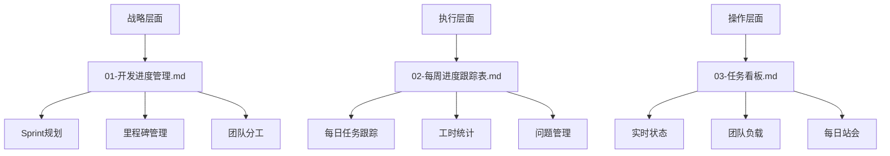

# TestMind AI - 项目管理文档中心

## 📁 文档目录结构

```
project-management/
├── README.md                           # 本文件 - 文档使用指南
├── 01-开发进度管理.md                   # 战略层面 - 总体规划和里程碑
├── 02-每周进度跟踪表.md                 # 执行层面 - 每日任务跟踪
├── 03-任务看板.md                      # 操作层面 - 实时状态管理
└── templates/                          # 模板文件夹
    ├── 每日站会模板.md
    ├── Sprint回顾模板.md
    └── 风险评估模板.md
```

---

## 🎯 文档使用指南

### 📋 三层管理体系



### 🔄 日常使用流程

#### 每日工作流程 (推荐时间：9:00-9:30)
1. **查看任务看板** (`03-任务看板.md`)
   - 检查今日任务安排
   - 更新昨日任务状态
   - 识别阻塞问题

2. **更新进度跟踪** (`02-每周进度跟踪表.md`)
   - 记录实际工时
   - 更新任务完成度
   - 记录遇到的问题

3. **每日站会** (使用 `03-任务看板.md` 中的站会模板)
   - 昨日完成情况
   - 今日计划
   - 遇到的阻塞

#### 每周工作流程 (推荐时间：周五下午)
1. **周度总结** (`02-每周进度跟踪表.md`)
   - 统计本周完成情况
   - 分析工时效率
   - 识别风险和问题

2. **调整计划** (`01-开发进度管理.md`)
   - 根据实际进度调整Sprint计划
   - 重新分配资源
   - 更新里程碑时间

#### 每Sprint工作流程 (每2周)
1. **Sprint回顾** (`01-开发进度管理.md`)
   - 评估Sprint目标达成情况
   - 总结经验教训
   - 调整下个Sprint计划

2. **更新总体规划**
   - 调整项目里程碑
   - 重新评估风险
   - 优化团队配置

---

## 🎯 Vibe Coding 集成说明

### 为AI提供的上下文信息

当您使用Vibe Coding方式开发时，AI可以通过这些文档快速理解：

#### 项目状态信息
- **当前Sprint**: 从 `01-开发进度管理.md` 获取
- **进行中任务**: 从 `03-任务看板.md` 获取
- **技术债务**: 从 `02-每周进度跟踪表.md` 获取
- **团队分工**: 从 `01-开发进度管理.md` 获取

#### 开发优先级
- **P0任务**: 核心功能，必须完成
- **P1任务**: 重要功能，优先完成
- **P2任务**: 增强功能，时间允许时完成

#### 质量标准
- **代码覆盖率**: ≥80%
- **代码审查**: 100%通过
- **性能要求**: API响应时间<200ms
- **安全要求**: 无高危漏洞

### AI协作建议

#### 开发任务对接
```markdown
# 向AI说明当前开发需求时，可以这样表达：

"我现在要开发 [任务ID] [任务名称]，这是 Sprint [X] 的 [优先级] 任务。
请查看 project-management/03-任务看板.md 了解当前状态，
参考 project-management/01-开发进度管理.md 了解技术要求。"
```

#### 进度同步
```markdown
# 完成开发任务后，可以这样更新：

"我已完成 [任务ID]，实际用时 [X]小时，
请帮我更新 project-management/03-任务看板.md 中的任务状态，
并在 project-management/02-每周进度跟踪表.md 中记录进度。"
```

---

## 📊 文档维护规范

### 更新频率
- **任务看板**: 每日更新
- **进度跟踪表**: 每日记录，每周总结
- **开发进度管理**: 每Sprint更新

### 维护责任
- **项目经理**: 负责整体规划和里程碑管理
- **技术负责人**: 负责技术任务分解和质量标准
- **开发团队**: 负责任务状态和工时记录

### 版本控制
- 所有文档变更都应该通过Git进行版本控制
- 重要变更需要在commit message中说明原因
- 建议每周创建一个进度快照分支

---

## 🚀 快速开始

### 新团队成员入职
1. 阅读本README文档
2. 查看 `01-开发进度管理.md` 了解项目整体规划
3. 查看 `03-任务看板.md` 了解当前任务分配
4. 参加每日站会，熟悉团队协作流程

### 开始新的Sprint
1. 更新 `01-开发进度管理.md` 中的Sprint规划
2. 在 `03-任务看板.md` 中创建新的任务列表
3. 初始化 `02-每周进度跟踪表.md` 的新周期记录

### 处理紧急问题
1. 在 `03-任务看板.md` 中标记为阻塞状态
2. 在 `02-每周进度跟踪表.md` 中记录问题详情
3. 通知项目经理和技术负责人
4. 在每日站会中讨论解决方案

---

## 📞 支持和反馈

### 文档问题反馈
- 发现文档错误或不清晰的地方，请及时反馈
- 建议改进的地方，欢迎提出优化建议
- 新的管理需求，可以讨论增加新的模板

### 工具集成
- 可以考虑与Jira、Trello等项目管理工具集成
- 支持导出为Excel格式进行数据分析
- 可以集成到CI/CD流程中自动更新状态

---

**文档版本**: v1.0  
**创建时间**: 2025-07-14  
**维护团队**: TestMind AI项目组  
**最后更新**: 2025-07-14
